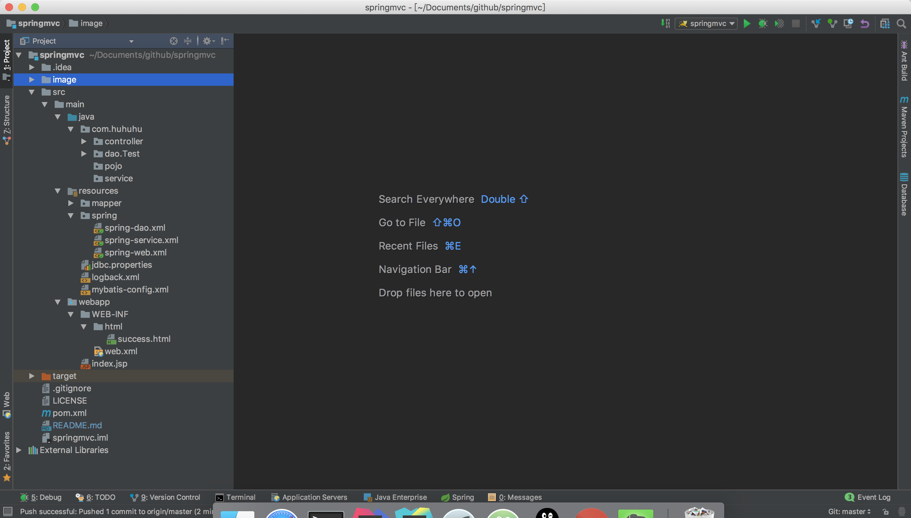
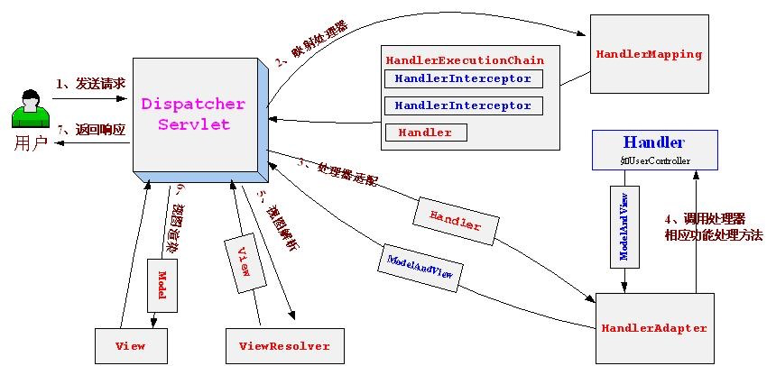

### Idea创建maven-springmvc

***

#### 搭建了项目主要环境
    jdk8，maven,mysql,tomcat9,springmvc,mybatis
***
#### [webxml](https://github.com/huhuhuHR/springmvc/blob/master/src/main/webapp/WEB-INF/web.xml)添加启动控制器，加载spring/spring-mvc.xml
    <servlet>
        <servlet-name>DispatcherServlet</servlet-name>
        <servlet-class>org.springframework.web.servlet.DispatcherServlet</servlet-class>
        <!-- 配置springMVC需要加载的配置文件
            spring-dao.xml,spring-service.xml,spring-application.xml
            Mybatis - > spring -> springmvc
         -->
        <init-param>
            <param-name>contextConfigLocation</param-name>
            <param-value>classpath:spring/spring-mvc.xml</param-value>
        </init-param>
        <!--指定当web容器启动时,加载servlet的顺序-->
        <load-on-startup>1</load-on-startup>
    </servlet>

    <servlet-mapping>
        <servlet-name>DispatcherServlet</servlet-name>
        <!-- 默认匹配所有的请求 -->
        <url-pattern>/</url-pattern>
    </servlet-mapping>
### [spring-mvc.xml](https://github.com/huhuhuHR/springmvc/blob/master/src/main/resources/spring/spring-mvc.xml)

### 添加spring监听加载配置项目
        <!--spring监听-->
        <context-param>
            <param-name>contextConfigLocation</param-name>
            <param-value>
                classpath:spring/spring-application.xml
                classpath:spring/spring-service.xml
                classpath:spring/spring-dao.xml
            </param-value>
        </context-param>
        <listener>
            <listener-class>org.springframework.web.context.ContextLoaderListener</listener-class>
        </listener>
### [spring-application.xml](https://github.com/huhuhuHR/springmvc/blob/master/src/main/resources/spring/spring-application.xml)
> spring相关配置以后就在这里边添加
### [spring-service.xml](https://github.com/huhuhuHR/springmvc/blob/master/src/main/resources/spring/spring-service.xml)
> 和业务相关的bean以后在这里边添加，例如搞个切面
### [spring-dao.xml](https://github.com/huhuhuHR/springmvc/blob/master/src/main/resources/spring/spring-dao.xml)
> spring整合mybatis

### [springmvc，匹配任何路径，导致没办法访问静态资源](https://www.cnblogs.com/dflmg/p/6393416.html)
    <servlet-mapping>
        <servlet-name>DispatcherServlet</servlet-name>
        <!-- 默认匹配所有的请求 -->
        <url-pattern>/</url-pattern>
    </servlet-mapping>
    方法一：
    <!-- 对静态资源文件的访问-->  
    <mvc:resources mapping="/html/**" location="/html/" cache-period="31556926"/>
    <mvc:resources mapping="/images/**" location="/WEB-INF/images/" cache-period="31556926"/>  
    <mvc:resources mapping="/js/**" location="/WEB-INF/js/" cache-period="31556926"/>  
    <mvc:resources mapping="/css/**" location="/WEB-INF/css/" cache-period="31556926"/>
    配置的作用是：DispatcherServlet不会拦截该配置的所有请求路径，并当作静态资源交由Servlet处理。
    <mvc:resources mapping="/html/**" location="/html/" cache-period="31556926"/> 这个配置是因为我想访问一些html为开始的静态页面
    <mvc:resources mapping="/js/**" location="/WEB-INF/js/" cache-period="31556926"/>   ftl中引用了js到前台，浏览器要加载，就得给它放开啊。
    方法二：
    <mvc:default-servlet-handler/>
***

# maven+spring的profile实现dev，pro分离
        <profiles>
            <!-- 开发环境 -->
            <profile>
                <id>dev</id>
                <activation>
                    <activeByDefault>true</activeByDefault>
                </activation>
                <build>
                    <filters>
                        <filter>src/main/resources/jdbc.properties</filter>
                        <filter>src/main/resources/dev_log.properties</filter>
                    </filters>
                </build>
            </profile>
            <!-- 开发环境 -->
            <profile>
                <id>pro</id>
                <build>
                    <filters>
                        <filter>src/main/resources/jdbc.properties</filter>
                        <filter>src/main/resources/pro_log.properties</filter>
                    </filters>
                </build>
            </profile>
        </profiles>
        <build>
            <finalName>springmvc</finalName>
            <resources>
                <resource>
                    <directory>src/main/resources</directory>
                    <includes>
                        <include>**/*</include>
                    </includes>
                    <filtering>true</filtering>
                    <excludes>
                        <exclude>test-spring.xml</exclude>
                    </excludes>
                </resource>
            </resources>
        </build>
> 一般生产，测试环境先就当是连接的数据库不同，日志等级不同，如上在maven中给他们不同环境导入不同的配置文件，
>  build这段代码会去你的xml把你的xml中${xx}替换调掉，从而做到灵活切换环境
    mvn clean package -Dmaven.test.skip=true -P dev
    mvn clean package -Dmaven.test.skip=true -P pro
    mvn clean package -Dmaven.test.skip=true 
        <activation>
            <activeByDefault>true</activeByDefault>
        </activation>
    在哪个下面哪个就是默认的
    
# loback日志整合
    <!--日志监听-->
    <context-param>
      <param-name>logbackConfigLocation</param-name>
      <param-value>
          classpath:logback.xml
      </param-value>
    </context-param>
    <listener>
      <listener-class>ch.qos.logback.ext.spring.web.LogbackConfigListener</listener-class>
    </listener>
> [日志整合](https://github.com/huhuhuHR/springmvc/blob/master/src/main/resources/logback.xml)

### springmvc理解过程

##### 步骤:[参考源头](https://github.com/brianway/springmvc-mybatis-learning)
* 1.发起请求到前端控制器(DispatcherServlet)
* 2.前端控制器请求处理器映射器(HandlerMapping)查找Handler(可根据xml配置、注解进行查找)
* 3.处理器映射器(HandlerMapping)向前端控制器返回Handler
* 4.前端控制器调用处理器适配器(HandlerAdapter)执行Handler
* 5.处理器适配器(HandlerAdapter)去执行Handler
* 6.Handler执行完，给适配器返回ModelAndView(Springmvc框架的一个底层对象)
* 7.处理器适配器(HandlerAdapter)向前端控制器返回ModelAndView
* 8.前端控制器(DispatcherServlet)请求视图解析器(ViewResolver)进行视图解析，根据逻辑视图名解析成真正的视图(jsp)
* 9.视图解析器(ViewResolver)向前端控制器(DispatcherServlet)返回View
* 10.前端控制器进行视图渲染，即将模型数据(在ModelAndView对象中)填充到request域
* 11.前端控制器向用户响应结果

### [html集成iconfont](https://www.cnblogs.com/hjvsdr/p/6639649.html)

### [SpringMVC之Web-整合ueditor编辑器](https://blog.csdn.net/xiaocha1994/article/details/78541962)

### SpringMVC之Web-整合ueditor编辑器-上传图片
1[能读到config.json](image/readconfig.png)
2[图片上传到哪里](image/where.png)
3.[最终位置](image/lastplace.png)

### 建表语句
    DROP TABLE IF EXISTS `hr_note_book`;
    /*!40101 SET @saved_cs_client     = @@character_set_client */;
    /*!40101 SET character_set_client = utf8 */;
    CREATE TABLE `hr_note_book` (
      `note_book_id` bigint(20) NOT NULL AUTO_INCREMENT COMMENT '笔记本id',
      `note_book_name` varchar(15) CHARACTER SET utf8 NOT NULL COMMENT '笔记本名字',
      `create_time` timestamp NOT NULL DEFAULT CURRENT_TIMESTAMP COMMENT '创建时间',
      `remove` char(1) CHARACTER SET utf8 NOT NULL DEFAULT '0' COMMENT '0 未删除 1 删除',
      `update_time` timestamp NOT NULL DEFAULT CURRENT_TIMESTAMP COMMENT '更新时间',
      PRIMARY KEY (`note_book_id`)
    ) ENGINE=InnoDB AUTO_INCREMENT=10 DEFAULT CHARSET=utf8 COLLATE=utf8_unicode_ci;
    
    DROP TABLE IF EXISTS `hr_note_notes`;
    /*!40101 SET @saved_cs_client     = @@character_set_client */;
    /*!40101 SET character_set_client = utf8 */;
    CREATE TABLE `hr_note_notes` (
      `note_id` bigint(20) NOT NULL AUTO_INCREMENT COMMENT '笔记id',
      `note_book_id` bigint(20) NOT NULL COMMENT '笔记本id',
      `note_name` varchar(50) CHARACTER SET utf8 NOT NULL COMMENT '笔记名称',
      `note_text` text CHARACTER SET utf8 NOT NULL COMMENT '笔记内容',
      `create_time` timestamp NOT NULL DEFAULT CURRENT_TIMESTAMP COMMENT '创建时间',
      `update_time` timestamp NOT NULL DEFAULT CURRENT_TIMESTAMP COMMENT '更新时间',
      `remove` char(1) CHARACTER SET utf8 NOT NULL DEFAULT '0' COMMENT '0 未删除 1 删除',
      PRIMARY KEY (`note_id`)
    ) ENGINE=InnoDB AUTO_INCREMENT=36 DEFAULT CHARSET=utf8 COLLATE=utf8_unicode_ci;
### 乱码问题
    1。请求乱码 tomcat URIEncoding="UTF-8"
    2。入库mysql乱码 ?useUnicode=true&amp;characterEncoding=UTF-8 xml中&为&amp;
    3。前台页面乱码 <meta charset="UTF-8">
    4。页面传来的字符串的中文乱码问题
        <!-- 解决Spring框架中从页面传来的字符串的中文乱码问题
           Spring框架给我们提供过滤器CharacterEncodingFilter
          这个过滤器就是针对于每次浏览器请求进行过滤的，然后再其之上添加了父类没有的功能即处理字符编码。
          其中encoding用来设置编码格式，forceEncoding用来设置是否理会 request.getCharacterEncoding()方法，
          设置为true则强制覆盖之前的编码格式,根据需要设置。-->
          <filter>
              <filter-name>characterEncodingFilter</filter-name>
              <filter-class>org.springframework.web.filter.CharacterEncodingFilter</filter-class>
              <init-param>
                  <param-name>encoding</param-name>
                  <!--用来指定一个具体的字符集-->
                  <param-value>UTF-8</param-value>
              </init-param>
              <init-param>
      
                  <param-name>forceEncoding</param-name>
                  <!--true：无论request是否指定了字符集，都使用encoding；false：如果request已指定一个字符集，则不使用encoding-->
                  <param-value>true</param-value>
              </init-param>
          </filter>
          <filter-mapping>
              <filter-name>characterEncodingFilter</filter-name>
              <url-pattern>/*</url-pattern>
          </filter-mapping>
### DispatcherServlet中使用的特殊的Bean
>1、Controller：处理器/页面控制器，做的是MVC中的C的事情，但控制逻辑转移到前端控制器了，用于对请求进行处理； 
>2、HandlerMapping：请求到处理器的映射，如果映射成功返回一个HandlerExecutionChain对象（包含一个Handler处理器（页面控制器）对象、多个HandlerInterceptor拦截器）对象；如BeanNameUrlHandlerMapping将URL与Bean名字映射，映射成功的Bean就是此处的处理器； 
>3、HandlerAdapter：HandlerAdapter将会把处理器包装为适配器，从而支持多种类型的处理器，即适配器设计模式的应用，从而很容易支持很多类型的处理器；如SimpleControllerHandlerAdapter将对实现了Controller接口的Bean进行适配，并且掉处理器的handleRequest方法进行功能处理； 
>4、ViewResolver：ViewResolver将把逻辑视图名解析为具体的View，通过这种策略模式，很容易更换其他视图技术；如InternalResourceViewResolver将逻辑视图名映射为jsp视图； 
>5、LocalResover：本地化解析，因为Spring支持国际化，因此LocalResover解析客户端的Locale信息从而方便进行国际化； 
>6、ThemeResovler：主题解析，通过它来实现一个页面多套风格，即常见的类似于软件皮肤效果； 
>7、MultipartResolver：文件上传解析，用于支持文件上传； 
>8、HandlerExceptionResolver：处理器异常解析，可以将异常映射到相应的统一错误界面，从而显示用户友好的界面（而不是给用户看到具体的错误信息）； 
>9、RequestToViewNameTranslator：当处理器没有返回逻辑视图名等相关信息时，自动将请求URL映射为逻辑视图名； 
>10、FlashMapManager：用于管理FlashMap的策略接口，FlashMap用于存储一个请求的输出，当进入另一个请求时作为该请求的输入，通常用于重定向场景，后边会细述。 

